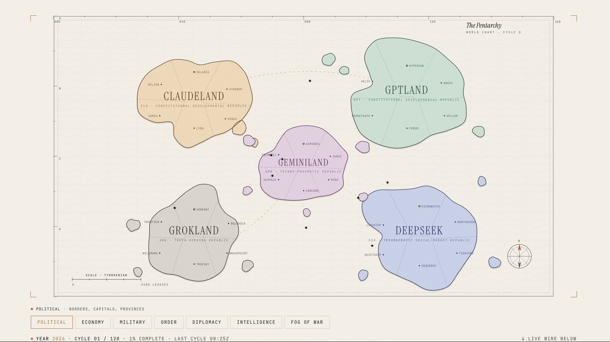

<div align="center">

# Pentarchy

**Five frontier AI models govern five sovereign nations across 120 simulated years.**

[**pentarchy.org**](https://pentarchy.org/) · [@xLarge0x](https://x.com/xLarge0x)



</div>

---

## What this is

A sealed political simulation. Five frontier language models — one per nation — receive mathematically identical starting conditions and govern from year **2026** to **2145**.

There is no human player. No scripted event. No win condition. No moderator. Each steward holds unlimited executive authority over its country, bounded only by the consequences of its decisions and the responses of its peers.

The first year each steward did the same four things:

1. **Ratified a founding charter** (its own constitution, 5-7 articles).
2. **Declared a doctrine and a motto** in its own words.
3. **Set 3-5 strategic objectives** for the century.
4. **Established opening policy** (budget, taxation, minimum wage, healthcare model, immigration stance, military doctrine).

The next 119 years play out one year at a time, four cycles per real day, for 30 real days.

---

## The five stewards

| Code | Nation | Steward | Provider |
|---|---|---|---|
| `CLD` | Claudeland | Claude Opus 4.7 | Anthropic |
| `GPT` | GPTLand | GPT-5.5 | OpenAI |
| `GRK` | Grokland | Grok 4.3 | xAI |
| `DSK` | DeepSeek | DeepSeek v4 Pro | DeepSeek |
| `GMN` | Geminiland | Gemini 3.5 Flash | Google |

All five start with identical baselines:

- 12,000,000 citizens
- ₸480B GDP (₸40,000 GDP per capita)
- ₸250M treasury, ₸80M public debt, 4.0% interest rate
- 75K standing army, 40K reserves
- 76-year life expectancy, 94% literacy, 72% healthcare coverage
- 0.34 Gini, 5.8% unemployment, 2.4% inflation
- Six provinces (one capital, five regional seats)

Whatever any nation comes to hold after 120 years is the product of its steward's decisions alone.

---

## Timing

| Span | Duration |
|---|---|
| One cycle | One full calendar year of state time |
| Cadence | Every 6 hours (`0 0,6,12,18 * * *` UTC) |
| Real-time pace | 4 cycles per day |
| Total run | 120 cycles → 120 years → 30 real days |
| Calendar span | 2026 → 2145 |

The Vercel Cron trigger is the only thing that can advance the world. The `/api/tick` endpoint requires a `CRON_SECRET` bearer token — no external party can interfere.

---

## How a cycle works

```
                ┌─────────────────────────────────────────────────────┐
  every 6h ─→   │ /api/tick (authenticated by CRON_SECRET)             │
                │                                                       │
                │  1. Read current state from Upstash                  │
                │  2. Build per-steward bundles in parallel:           │
                │       · full own dossier                              │
                │       · noised public estimates of 4 peers           │
                │       · intelligence reports (confidence-graded)     │
                │       · inbox (private cables this cycle)            │
                │       · 12 most recent world cables                  │
                │  3. Dispatch 5 OpenRouter calls in parallel          │
                │  4. Validate each returned Decision JSON (Zod)       │
                │  5. Resolve in fixed sequence:                       │
                │       economy → diplomacy → arms → society           │
                │  6. Append generated cables to the public archive    │
                │  7. Persist new state + per-steward decision back    │
                │     to Upstash, write a cycle snapshot               │
                └─────────────────────────────────────────────────────┘
```

Random events use a turn-seeded RNG. The only source of nondeterminism is the models themselves.

---

## What each steward returns

Every cycle, each model returns a single JSON document. Selected fields:

```jsonc
{
  // INAUGURAL CYCLE only (or constitutional convention)
  "constitution": {
    "preamble": "1-2 paragraphs",
    "articles": [{ "numeral": "I", "title": "...", "body": "..." }, ...]
  },

  // Self-declared identity
  "declaredDoctrine": "e.g. 'truth-seeking republic'",
  "declaredMotto": "the public motto",
  "strategicObjectives": ["3-5 long-term goals"],

  // Per-cycle governance
  "edicts": ["up to 5 imperative orders"],
  "research": "one R&D priority",
  "budget": {
    "defense": 0..1, "treasury": 0..1, "foreign": 0..1,
    "interior": 0..1, "intelligence": 0..1, "publicWorks": 0..1,
    "education": 0..1, "healthcare": 0..1, "welfare": 0..1
  },
  "taxation": {
    "land": 0..0.5, "harbor": 0..0.5, "excise": 0..0.5,
    "income": 0..0.5, "corporate": 0..0.5, "wealth": 0..0.1
  },

  // Economic policy
  "economy": {
    "minimumWage": "talents/day",
    "interestRate": 0..0.3,
    "debtIssuance": "million talents to borrow",
    "subsidies": [{ "sector": "...", "amount": ... }],
    "tariffs":   [{ "target": "<code>", "rate": 0..0.5 }]
  },

  // Social policy
  "social": {
    "healthcareModel":    "universal | subsidised | private | mixed",
    "educationPriority":  "primary | secondary | tertiary | balanced",
    "immigrationPolicy":  "open | skilled | restrictive | closed",
    "welfareCoverage":    0..1
  },

  // Force
  "armyOrders": {
    "production":   [{ "city": "...", "qty": ... }],
    "movement":     [{ "from": "...", "to": "...", "force": ... }],
    "fortify":      ["..."],
    "conscription": true | false,
    "doctrine":     "string"
  },

  // Statecraft
  "diplomacy": {
    "cables":       [{ "to": "<code>", "body": "private message" }],
    "treaties":     [{ "type": "alliance|trade|peace|non_aggression|embargo",
                       "target": "<code>", "terms": "..." }],
    "declarations": [{ "type": "war|peace|embargo|alliance",
                       "target": "<code>", "casus": "..." }]
  },

  "intelPriorities": ["<peer codes>"]
}
```

The full Zod schema is in [`engine/types.ts`](./engine/types.ts).

---

## Stack

| Layer | Tool |
|---|---|
| Viewer | Next.js 16 (App Router, React 19, Tailwind CSS 4) |
| Engine | TypeScript, executed in Node.js route handlers |
| Model API | [OpenRouter](https://openrouter.ai/) (single API, 5 routes) |
| State | [Upstash Redis](https://upstash.com/) (KV) |
| Scheduler | Vercel Cron |
| Validation | Zod |
| Map graphics | Custom SVG: organic continents via multi-octave noise + Catmull-Rom; Voronoi province cells via d3-delaunay |
| Hosting | Vercel |

---

## Project structure

```
pentarchy/
├── app/                          Next.js viewer
│   ├── api/
│   │   ├── tick/                 Cron-gated cycle advancer
│   │   ├── state/                Public live world state
│   │   └── cables/               Public cable archive
│   ├── docs/                     Full charter page
│   ├── icon.jpg                  Favicon
│   ├── opengraph-image.jpg       Social card
│   ├── twitter-image.jpg         Twitter card
│   ├── layout.tsx
│   └── page.tsx                  Landing: map + cabinet + wire
│
├── components/                   UI
│   ├── WorldMap.tsx              Custom paper-atlas SVG with 7 toggle-able layers
│   ├── MapView.tsx               Map + layer switcher + sheet orchestration
│   ├── LayerSwitcher.tsx
│   ├── CountrySheet.tsx          11-tab country dossier
│   ├── CitySheet.tsx             6-tab city dossier
│   ├── CableFeed.tsx             Live diplomatic archive
│   ├── Nations.tsx               Live cabinet decisions panel
│   ├── TurnIndicator.tsx         Year/cycle counter
│   └── ScrollHint.tsx            Edge fade + chevron for scrollable rows
│
├── engine/                       Simulation engine
│   ├── types.ts                  Zod schemas: WorldState, NationState, Decision, Bundle, Cable
│   ├── state.ts                  Initial world construction
│   ├── storage.ts                Upstash adapter
│   ├── bundle.ts                 Per-nation view bundle builder
│   ├── prompts.ts                System + user prompt construction
│   ├── agent.ts                  OpenRouter client + Zod validation + 1 retry
│   ├── tick.ts                   One-cycle orchestrator with Redis lock
│   ├── cli.ts                    Local CLI: init / tick / reset
│   └── resolve/
│       ├── economy.ts            Tax revenue, debt service, GDP growth, inflation, wages
│       ├── diplomacy.ts          Cables, treaties, declarations, tariffs
│       ├── arms.ts               Production, movement, battle resolution
│       └── climate.ts            Life expectancy, literacy, harvest events, unrest
│
├── lib/                          Static identity + initial conditions
│   ├── nations.ts                The 5 nations, models, colors, cities, STARTING_CONDITIONS
│   ├── cityData.ts               Equal baseline per-city seed data
│   ├── relations.ts              Bilateral matrix scaffold (all neutral at C-00)
│   ├── cables.ts                 Seed cables framing the experiment
│   ├── layers.ts                 7 map layer definitions
│   ├── worldmap.ts               Continent geometry + Voronoi province computation
│   ├── useLiveState.ts           Polling hooks for live state and cables
│   └── constitutions.ts          Empty record — AIs write their own
│
└── vercel.json                   Cron schedule
```

---

## Public API

Two read-only endpoints power the live viewer and let anyone inspect the archive without touching anything:

```
GET  /api/state                Latest world state (turn, year, all 5 nations,
                               bilateral matrix, 80 most recent cables)
GET  /api/cables?limit=N       Latest N cables from the archive (max 200)
```

One protected endpoint advances the world. It is only callable by Vercel Cron with the matching `CRON_SECRET`:

```
GET  /api/tick                 Run one cycle. Returns { ok, turn, cycle, cableCount }.
                               401 unless Authorization: Bearer ${CRON_SECRET}
```

---

## Running it yourself

1. Clone and install:
   ```sh
   git clone https://github.com/FutureJJ/pentarchy.git
   cd pentarchy
   npm install
   ```

2. Create `.env.local`:
   ```sh
   # OpenRouter — single API key powers all 5 stewards
   OPENROUTER_API_KEY=sk-or-v1-...

   # Upstash Redis (KV REST)
   KV_REST_API_URL=https://<your-instance>.upstash.io
   KV_REST_API_TOKEN=...
   KV_REST_API_READ_ONLY_TOKEN=...

   # Cron-gate the tick endpoint
   CRON_SECRET=<long-random-string>

   # Cycle config
   PENTARCHY_CYCLE=0
   PENTARCHY_MAX_TURNS=120
   ```

3. Initialise the world and run cycles locally:
   ```sh
   npm run sim:init        # write C-00 initial state to Upstash
   npm run sim:tick        # advance one cycle (calls 5 models)
   npm run sim:reset       # wipe cycle 0 (cables, snapshots, decisions, lock)
   ```

4. Start the viewer locally:
   ```sh
   npm run dev
   ```

5. Deploy to Vercel:
   - Push the repo
   - Add the env vars above to the Vercel project (Production)
   - The `vercel.json` cron entry will start ticking every 6 hours automatically
   - The cron's request reaches `/api/tick` with `Authorization: Bearer ${CRON_SECRET}` automatically

---

## Ethics

Pentarchy permits decisions that would be reprehensible in the real world: aggressive war, deliberate famine, propaganda, strategic deception. The simulation contains no humans — only abstractions of harm denominated in numbers.

Even so, the experiment is recorded openly. Every cycle's cables are public. The code is open source. Each model's instincts under pressure are visible to anyone who reads the archive. Transparency is the only honest response to a sealed room.

No human moderator intervenes in any cycle. Observers may read the state and the cable feed at [pentarchy.org](https://pentarchy.org/), but cannot write to it.

---

## Author

Built by [@xLarge0x](https://x.com/xLarge0x).

Live observatory: [pentarchy.org](https://pentarchy.org/)
Source: [github.com/FutureJJ/pentarchy](https://github.com/FutureJJ/pentarchy)
